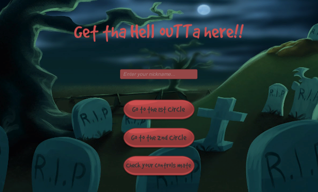
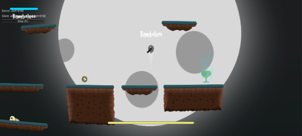
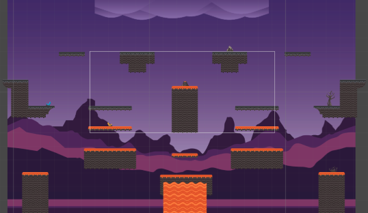
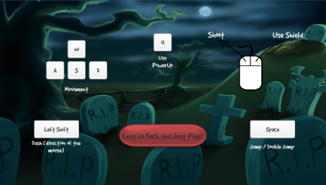

# G-TH-OH
> Multiplayer Platform Game developed with friends inspired in Dante's Hell

Main menu of the game, currently there are 2 levels fully developed.

## Installation

Dependencies for both MacOS and Windows :

* Unity v2017.4.37f1 LTS

## Multiplayer

* Guarantee that everyone is in the same lan
* Use ip placeholder at the beggining of the game to place the host IP
  * Hint: Use an internet switch to minimize problems.
  
  
## ScreenShots

## Controls

## Contributors
  
* [César Mendes (me)](https://github.com/cfilipemendes)
* [José Franco](https://github.com/josepfranco)
* Andre Vieira
